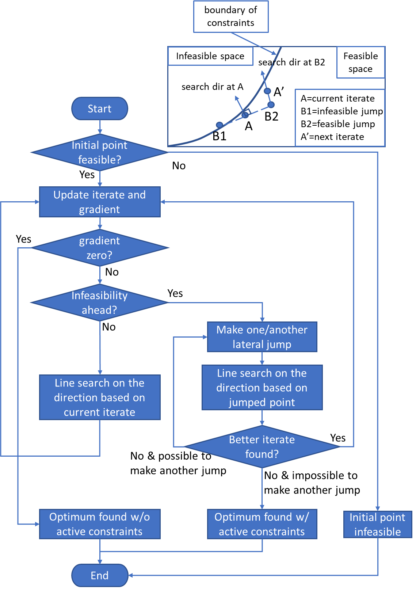

# Internal-Search Algorithm for Constrained Optimization

## Summary

This project aims to develop an internal-search optimization (ISO) algorithm for solving constrained optimization problems. The ISO algorithm is especially advantageous for solving problems whose constraint functions are ill-conditioned, e.g. nonsmooth, but it can be applied to general constrained optimization problems whose objective functions are at least 1st-order smooth.

A flowchart of the algorithm can be found at the bottom.

## Programming language

The solver package is developed in Python and MATLAB. See file descriptions below.

## File descriptions

### Python version (ipython notebook)

* "Python_package&test.ipynb": an ipython notebook that contains the implementation of the ISO algorithm and three case studies to demonstrate the effectiveness of the algorithm in solving problems  under representative conditions.

### MATLAB version

* "InterSearchFunc.m": main function of the developed algorithm
* "InterSearchFunc_rect.m": entrance function which rectifies the inputs (normalize the objective functions and variable bounds, etc.) before applying the internal search algorithm
* "main_RBDO_case_test.m": main script for testing the optimization algorithm on an RBDO case problem.

## Flowchart of the algorithm
